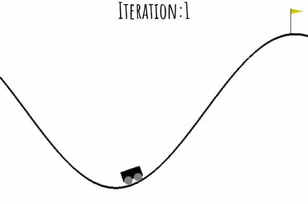
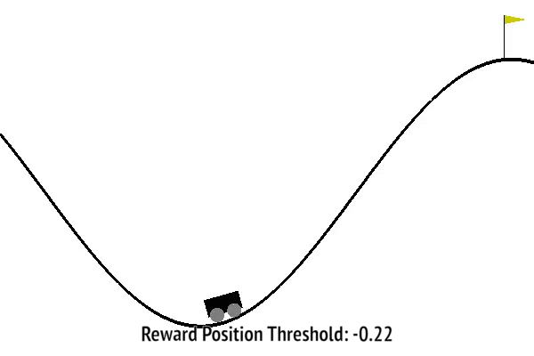
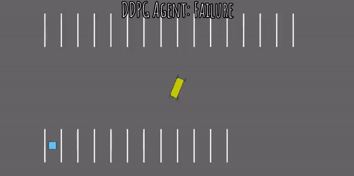
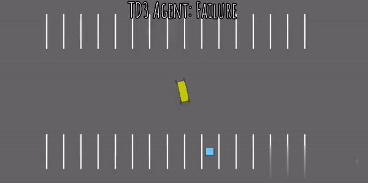

## liveProject: Prototyping self-driving agents in OpenAI Gym with Reinforcement Learning

This github repository contains implementations of _liveProject: Prototyping self-driving agents with OpenAI with Reinforcement Learning (RL)_ for reference purposes. This repository includes two different types of implementations. First, containing agent implementations from scratch and second approach uses `stable-baselines` or `rl-agents` like packages to directly import algorithms for fast prototyping to evaluate the performance of the models.  

In this liveProject we explore the tools, techniques and methodologies used by AI researchers to quantify the performance of an agent in a given environment to achieve a given task. The use-case that we explore is navigating and performing different tasks across multiple driving environments. We explore different basic and abstract driving environments for prototyping some RL algorithm implementations in this beginner centered `up-for-grabs` liveProject.  

## Agent implementations for  milestones

### Milestone 1

  
  
  

<b>Figure 1:</b> Value Function Approximation with Q-table <em>(Left)</em>, Reward Shaping <em>(Middle)</em> and its optimization iteration <em>(Right)</em>.

* __Milestone 1:__ Getting started with Reinforcement Learning.
  * Setting up Google Colab notebook, rendering OpenAI environments and practical RL introduction.
    * Limitations for _Value Iteration_ and _Policy Iteration_ algorithms even in `toy-text` scenarios.
  * Value function approximation implementation with Q-table and exploration for OpenAI's `MountainCar-v0` environment.
    * Handling sparse rewards scenarios in goal based environments like `MountainCar-v0` environment.
  * __Deliverable 1:__ Evaluating variations in agent behavior for our hand-built reward functions while training our `MountainCar-v0` agent and documenting the experiment findings for peer review by your team.

### Milestone 2

  
  
  

<b>Figure 2:</b> Outputs of partially trained agents for the parking task with DDPG <em>(Left)</em>, TD3 <em>(Middle)</em> and SAC <em>(Right)</em> actor-critic RL methods. For each method three different outcome stages are shown above namely failure, partial success and complete goal completion.

* __Milestone 2:__ Improving the agents performance with SARSA lambda learning and starting agent prototyping with `highway-env` package.
  * _Temporal Difference Learning_ introduction and _State–action–reward–state–action (SARSA lambda)_ agent implementation for `MountainCar-v0` environment of OpenAI.
  * Exploring goal based parking task on parking task `highway-env` package with _HER_ and _SAC_ from `stable-baselines` package algorithms in `parking-v0` environment.
  * __Deliverable 2:__ Implementation and documentation of _HER_ supported algorithms like _DDPG, TD3 and SAC_ for parking task on third party _highway-env_ package in `parking-v0` environment.

### Milestone 3

* __Milestone 3:__ Designing plan oriented agents that use searching capabilities to navigate across optimal paths in an environment.
  * _Monte Carlo Tree Search (MCTS)_ Implementation for Toy Text `Taxi-v3` environments.
  * Introduction to navigation environments in `highway-env` package and MCTS agent prototyping for all these navigation based tasks with `rl-agents` package.
  * __Deliverable 3:__ Creating a MCTS learning and evaluation functional structure to evaluate the agent performance for different environments present in `highway-env` package.
    * The current generic implementation doesn't work optimally for these different environments in `highway-env` package. You can skip the optimization and performance analysis part.

* __Certification Test:__ Final certification test task and questions to test the understanding developed by the learner while working with `rl-agents` package.

  
  
  

<b>Figure 3:</b> Outputs of trained MCTS agents with same parameters that are under evaluation in certification test.

By working on these different implementation and prototyping tasks we learn upon the importance of relatively different paradigms in reinforcement learning which might not be exactly part of current state of the art methodologies but still relevant in many relatively simpler scenarios. We also learn about documenting, comparing and designing experiments for evaluation of agent performance in quantitative and qualitative terms which is again very important in the domain of RL research.  

## Acknowledgements

* Thank you to  for providing and maintaining the  and  packages.
* Thanks to  team and   for providing efficient and well documented implementations of RL algorithms in a single .
* Also, thanking   for an interesting implementation use-case of reward shaping.
