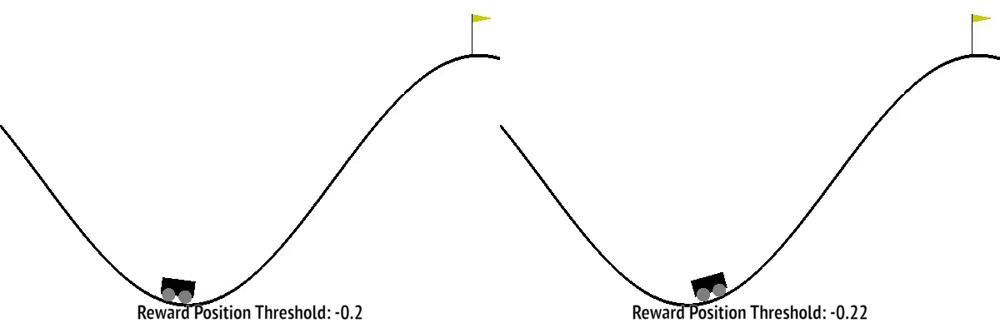

## liveProject: Prototyping self-driving agents in OpenAI Gym with Reinforcement Learning

This the github repository contains implementations of _liveProject: Prototyping self-driving agents with OpenAI with Reinforcement Learning (RL)_ for reference purposes. This repositories includes two different types of implementations. First, containing agent implementations from scratch and second approach uses `baselines` like packages to directly import algorithms for fast prototyping.

In this liveProject we explore the tools, techniques and methodologies used by AI researchers to quantify the performance of an agent in a given environment. We explore different basic and abstract driving environments for prototyping some RL algorithm implementations in this beginner friendly `up-for-grabs` liveProject. 

     
    <em><b>Figure 1: A reward shaping method's output comparison figure.</b></em>

     
    <em><b>Figure 2: Episodes of some of the environments available in highway-env.</b></em>

## Agent implementations for  milestones

* __Milestone 1:__ Getting started with Reinforcement Learning.
  * Setting up Google Colab notebook, rendering OpenAI environments and practical RL introduction.
    * Limitaions for `Value Iteration` and `Policy Iteration` algorithms.
  * Value function approximation implementation with Q-table and exploration for OpenAI's _'MountainCar-v0'_ environment.
  * __Deliverable 1:__ Designing hand-built reward functions to train _'MountainCar-v0'_ agent and documenting the experiment findings.

* __Milestone 2:__ Improving the agents performance with TD learning and starting agent prototyping with `highway-env`.
  * _Temporal Difference Learning_ implementation for _'MountainCar-v0'_ environment of OpenAI.
  * Exploring goal based parking task on _highway-env_ with DDPG from `rl-agent` package algorithms.
  * __Deliverable 2:__ Implementation and documentation of HER algorithm for parking task on third party _highway-env_ environment.

* __Milestone 3:__ Designing plan oriented that uses searching capabilities to navigate across optimal path.
  * Monte Carlo Tree Search(MCTS) Implementation for Toy Text `Taxi-v3` environments.
  * MCTS experimentation for highway-env lane changing task on third party _highway-env_ environment with `rl-agents` package.
  * __Deliverable 3:__ MCTS experimentation and documentation for agent successfully completing intersection and roundabout task for `highway-env` environment.
  
By working on these different implementation tasks we learn upon importance of relatively different paradigms in reinforcement learning which are not part of current state of the art methodologies but still relevant in certain specific scenarios and covers vast breath of different approaches in RL domain.  
