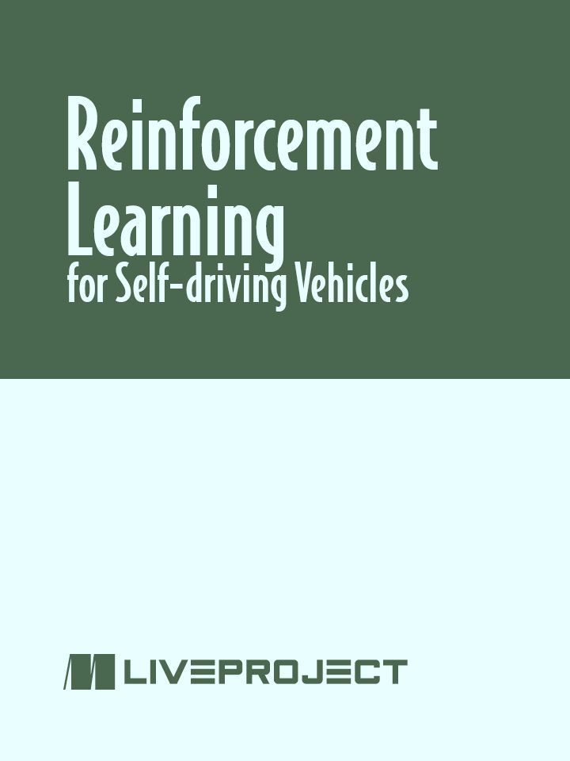
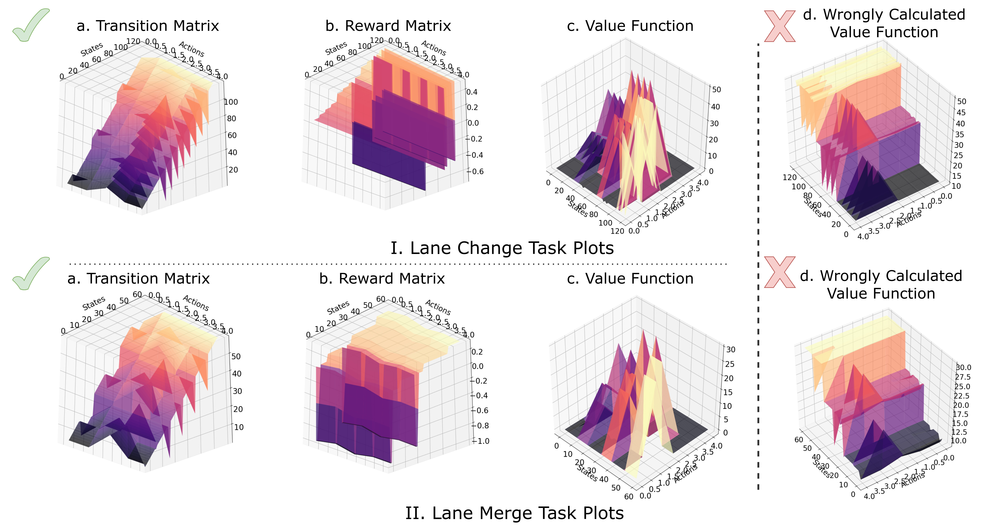
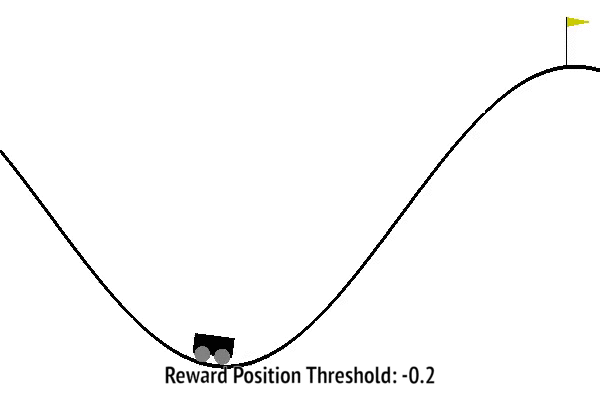
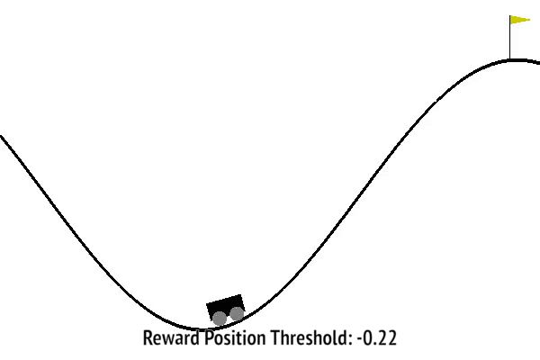
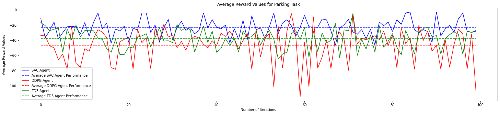
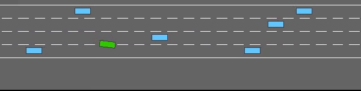
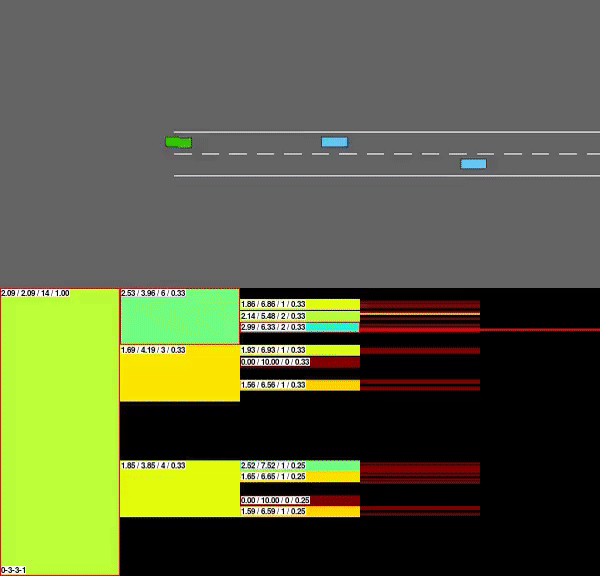
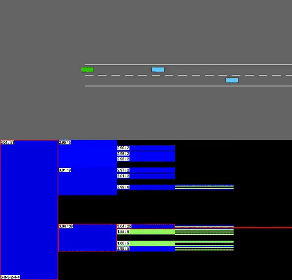

<b>liveProject: Reinforcement Learning for self driving vehicles</b>

## : Build & Research solutions for autonomous driving agents

This github repository contains implementations of _liveProject: Reinforcement Learning for self-driving vehicles_ for reference purposes. This repository includes two different types of implementations. First, containing agent implementations from scratch and second approach uses `stable-baselines` or `rl-agents` like packages to directly import algorithms for fast prototyping to evaluate the performance of the models.

In this liveProject we explore the tools, techniques and methodologies used by AI researchers to quantify the performance of an agent in a given environment to achieve a given task. The use-case that we explore is navigating and performing different tasks across multiple driving environments. We explore different basic and abstract driving environments for prototyping some RL algorithm implementations in this beginner centered `up-for-grabs` liveProject.

**Note:** For all the *Colab Implementation Links* below please create your own copy and proceed with the code editing, execution and testing process.

## Agent implementations for milestones

This liveProject is analyzed based on three simple working principles in AI: optimize, explore & simplify. The practical applications of these concepts are elaborated over from Milestone Two, Three & Four. Also, we have an introduction Milestone that focuses primarily on visualization techniques.

### Milestone One: Visualization

* __Milestone One:__ **Visualization** in Reinforcement Learning for problem & result analysis.
  * Getting started with Google Colab environments & notebooks with OpenAI.
  * Introduction to RL with _Value Iteration_ algorithm in simple environments.
    * Limitations for _Value Iteration_ algorithm in `Taxi-v3` scenario. [Colab Implementation Link](https://colab.research.google.com/drive/1nv9RhHROLygRGid3kOXOjeDKtDVDW8nO?usp=sharing)
  * Developing _Value Iteration_ for MDP based driving scenarios in the `highway-env` package. [Colab Implementation Link](https://colab.research.google.com/drive/1Wryvxq4mwt_cBiJ9tBEVJYjLvZHb4vpt?usp=sharing)
  * __Deliverable One:__ Comparative result **Visualizations** for discussed algorithms in MDP based driving scenarios.

  

<b>Figure 1:</b> Lane change and highway merge <em>(additional)</em> tasks plots for reference.

### Milestone Two: Optimize

* __Milestone Two:__ **Optimizing** a given agent's performance to its fullest potential.
  * Setting up Google Colab notebooks for rendering OpenAI environments outputs. [Colab Implementation Link](https://colab.research.google.com/drive/1JcPq0z32Za9NbkEtXHUv4hrj45gbZ1SC?usp=sharing)
    * Value function approximation implementation with Q-table and exploration for OpenAI's `MountainCar-v0` environment. [Colab Implementation Link](https://colab.research.google.com/drive/1UmXp3XzAXzGw21pqY_m74Oqp72-CmNez?usp=sharing)
  * Handling sparse rewards scenarios in goal based environments like `MountainCar-v0` environment. [Colab Implementation Link](https://colab.research.google.com/drive/1NeIyQ7qyxAc0SYMiX5W86karPkDQzhLe?usp=sharing)
  * __Deliverable Two:__ Evaluating & documenting variations in agent behavior for our hand-built reward functions to develop the most **optimized** agent in `MountainCar-v0` for this approach.

  
  

<b>Figure 2:</b> Reward Shaping approach output <em>(Left)</em> & its Optimized Iteration output <em>(Right)</em> respectively.

### Milestone Three: Explore

* __Milestone Three:__ **Exploring** new algorithms for achieving better performance in goal based driving tasks.
  * _State–action–reward–state–action (SARSA lambda)_ agent implementation for `MountainCar-v0` environment to learn agent designing concepts. [Colab Implementation Link](https://colab.research.google.com/drive/1wwjP-Rr8GmvLO9P39scbjUOamVBv_6Nx?usp=sharing)
  * **Exploring** new RL algorithms for goal based parking task on `highway-env` package with _HER_ and _SAC_ from `stable-baselines3` RL algorithms package. [Colab Implementation Link](https://colab.research.google.com/drive/1vQnslmenp5c95jVAwVEl7xXspgc3IPqx?usp=sharing)
  * __Deliverable Three:__ Implementation, Analysis and Documentation of _HER_ supported algorithms like _DDPG, TD3 and SAC_ for the parking task on third party _highway-env_ package in `parking-v0` environment.

  

<b>Figure 3:</b> Mean average reward plot for performance evaluation of SAC, TD3 & DDPG equipped with HER.

Additionally, if you are interested in reviewing the code base of the Tensorflow based stable-baselines package, you can check their earlier [archived](https://github.com/hill-a/stable-baselines) repository. Also, you can also refer to theTensorflow backend based implementation of HER based SAC agent as well, just to see turnarounds required for running the earlier  stable-baselines. [Colab Implementation Link](https://colab.research.google.com/drive/1RHxj9WOcZ8XjlQXGu46RKVG6T-jA2dU-?usp=sharing)

### Milestone Four: Simplify

* __Milestone Four:__ Designing plan oriented agents that use searching capabilities to navigate across optimal paths in an environment.
  * _Monte Carlo Tree Search (MCTS)_ Implementation for Toy Text `Taxi-v3` environments.
  * Introduction to navigation environments in `highway-env` package and MCTS agent prototyping for all these navigation based tasks with `rl-agents` package.
  * __Deliverable 3:__ Creating a MCTS learning and evaluation functional structure to evaluate the agent performance for different environments present in the `highway-env` package.

    **Note:** The current generic implementation doesn't work optimally for these different environments in the `highway-env` package. You can skip the optimization and performance analysis part.

### Certification Test

* __Certification Test:__ Final certification test checks the understanding developed by you during the liveProject.

  
  
  

<b>Figure 4:</b> Outputs of different trained MCTS agents with the same parameters that are under evaluation in the certification test.

### Building Your Own Environment

This is a supplementary section that covers an additional topic of making a custom environment as per one's need.

* __Building Custom Environments__ In this notebook we create a sample environment for _highway-env_ package and use the _rl-agent_ package to create a baseline planner agent corresponding to that environment. [Colab Implementation Link](https://colab.research.google.com/drive/1PoSbv_o1I9tkCIsCRn3lBYzcRGH_qVAu?usp=sharing)

  
  

<b>Figure 5:</b> U-Turn environment baseline agents namely MCTS Agent <i>(Left)</i> and Deterministic Agent <i>(Right)</i>.

## Acknowledgements

* Thank you to  for providing and maintaining the  and  packages.
* Thanks to  team and   for providing efficient and well documented implementations of RL algorithms in a single .
* Also, thanks to  for an interesting implementation use-case of reward shaping.
* Great improvement suggestions were provided by ,  & . It's because of them this project has reached its current stage. Thank you for all the support & help!
