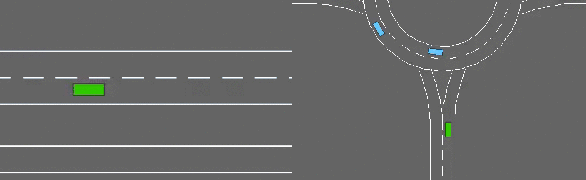

### liveProject: Prototyping self-driving agents in OpenAI Gym with Reinforcement Learning

This the github repository contains implementations for _liveProject: Prototyping self-driving agents with OpenAI with Reinforcement Learning (RL)_ for reference purposes. This repositories includes the following implementation as must in the stated directory structure.

A collection of serial interrelated experiments in environments for <em>autonomous driving</em> and tactical decision-making tasks.

     
    <em><b>Episodes of some of the environments available in highway-env.</b></em>

#### Agent implementations for a given milestone

* __Milestone 1:__ Getting started with Reinforcement Learning.
  * Setting up Google Colab notebook, rendering OpenAI environments and RL introduction.
  * Value function approximation implementation for OpenAI's _'MountainCar-v0'_ environment.
  * __Deliverable 1:__ Implementation of  Value function approximation implementation for lane changing task of third party _highway-env_ environment.

* __Milestone 2:__ Improving the agents performance with temporal difference learning.
  * _Temporal Difference Learning_ implementation for _'MountainCar-v0'_ environment of OpenAI.
  * Temporal Learning agent implementation for lane changing task on _highway-env_.
  * __Deliverable 2:__ Implementation of Model free Temporal Learning agent for roundabout and intersection task on third party _highway-env_ environment.

* __Milestone 3:__ Designing plan oriented that uses searching capabilities to navigate across optimal path.
  * Monte Carlo Tree Search(MCTS) Implementation for minimal environments.
  * MCTS implementation for highway-env lane changing task on third party _highway-env_ environment.
  * __Deliverable 3:__ MCTS implementation for agent successfully completing parking task for `highway-env` environment.
  
By working on these different implementation tasks we learn upon importance of different relatively different paradigms in reinforcement learning which are not part of current state of the art methodologies but still relevant in certain specific scenarios and covers vast breath of different approaches in RL domain.  
